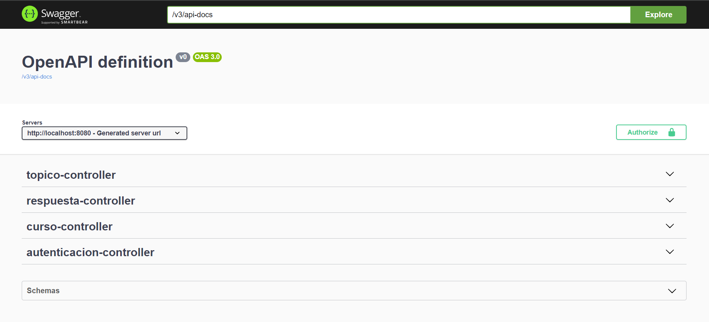
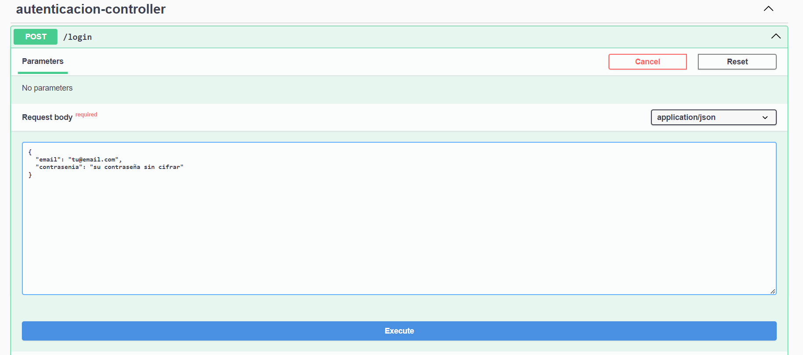
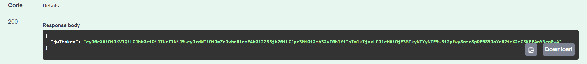
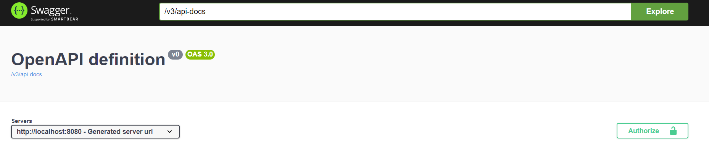
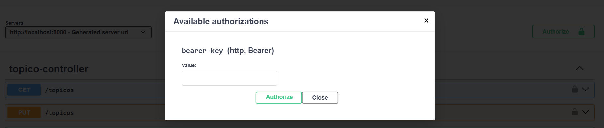
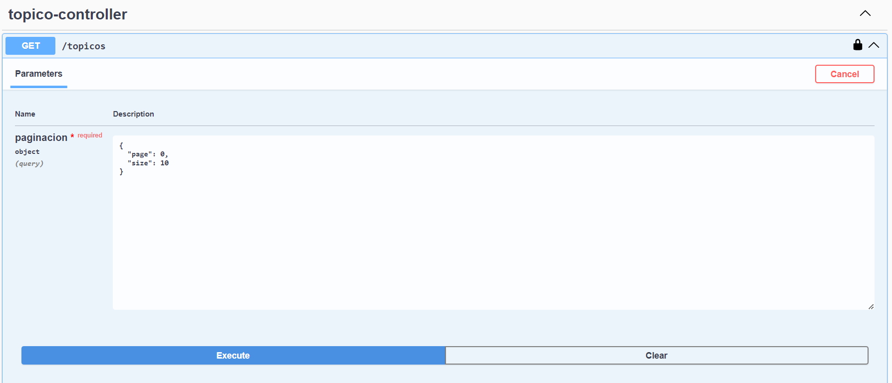
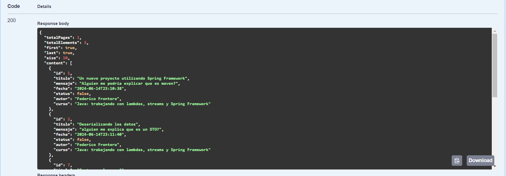

<h1>
  <b>API Rest Foro</b>
</h1>

<h2>
    Desafio planteado por <a href="https://www.aluracursos.com/">Alura latam</a>.
</h2>

<h2>
  Informacion
</h2>

  El forohubAPI  permite a los usuarios realizar las siguientes operaciones enfocadas en los tópicos.

<ul>
  <li>
    Crear nuevo tópico
  </li>
  <li>
    Mostrar todos los tópicos creados
  </li>
  <li>
    Mostrar tópico específico
  </li>
  <li>
    Mostrar tópico específico
  </li>
  <li>
    Actualizar tópico
  </li>
  <li>
    Eliminar tópico
  </li>
</ul>

<h2>
  Configuraciones entorno
</h2>

<ul>
  <li>
    Java (versión 17) 
  </li>
  <li>
    Maven
  </li>
  <li>
    Spring Boot (versión 3.3.1)
    Dependencias:
      <ul>
        <li>
          Lombok  
        </li>
        <li>
          Spring Web
        </li>
        <li>
          Spring Boot DevTools
        </li>
        <li>
          Spring Data JPA
        </li>
        <li>
          Flyway Migration
        </li>
        <li>
          MySQL Driver
        </li>
        <li>
          Validation
        </li>
        <li>
          Spring Security
        </li>
      </ul>
  </li>
</ul>

<h2>
    Documentacion
</h2>

    Se implemento Swagger para documentar la aplicación, con el objetivo de generar
    interfaz amigable y accesible.

    Para poder hacer uso de la API es necesario cargar un usuario en bd, por razones de tiempo
no se a generado un end point para realizar tal cosa, por lo tanto debe realizarse de forma la inserción
en la bd "<code>INSERT INTO usuarios (nombre, email, contrasenia)
VALUES ('su nombre', 'su email' , 'contraseña');</code>".
Cabe destacar que la contraseña debe de estar cifrada con BCrypt a la hora de guardarla en la db.

    Una vez realizada la carga de un nuevo usuario, podemos hacer uso de la interface brindada por Swagger
para poder testear el uso de la API.

    Como primer paso, para poder usar la interfaz de Swagger, debemos logearnos con los datos del usuario generado
anteriormente.

    Ir a autenticacion-controller, desplegamos y clickeamos Try it now.
 
Cargamos los datos de login en el request body y clic en Execute.

    Como respuesta obtenemos un estado 200, en cuyo body se encuentra el token generado para poder autenticar las demás 
pruebas.

    Copiamos el token y lo insertamos dentro de Autorize , en el campo value y clickeamos Authorize.

    Ahora estamos listos para usar la API.

    A modo de ejemplo ponemos imagenes de como listar los topicos.

    Request listado de Topicos.

    Response listado de Topicos.

    Cabe destacar que todos los listados estan paginados.

